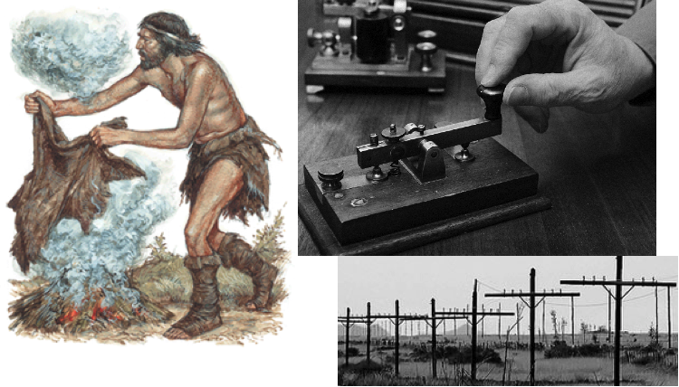
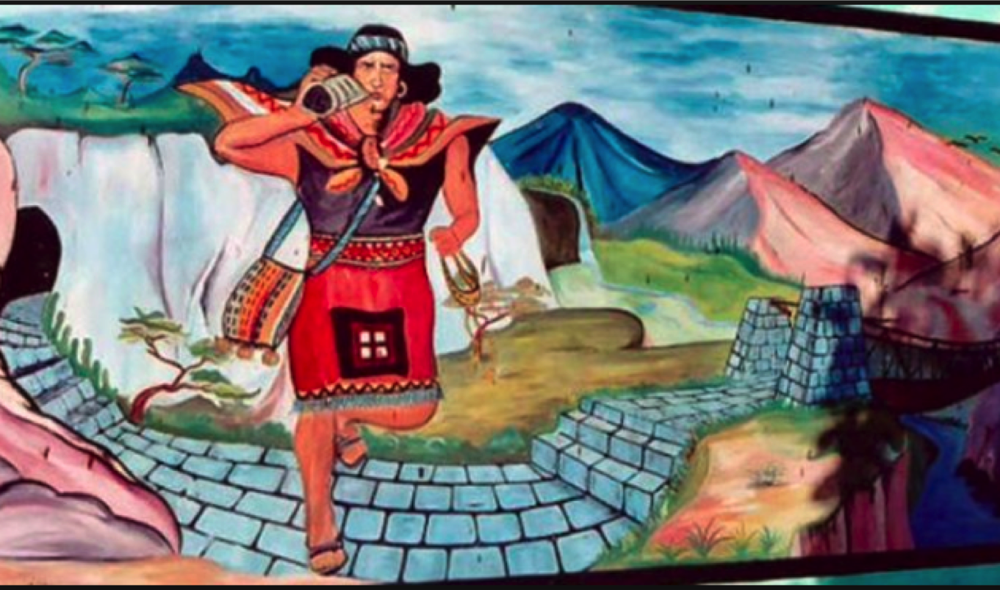
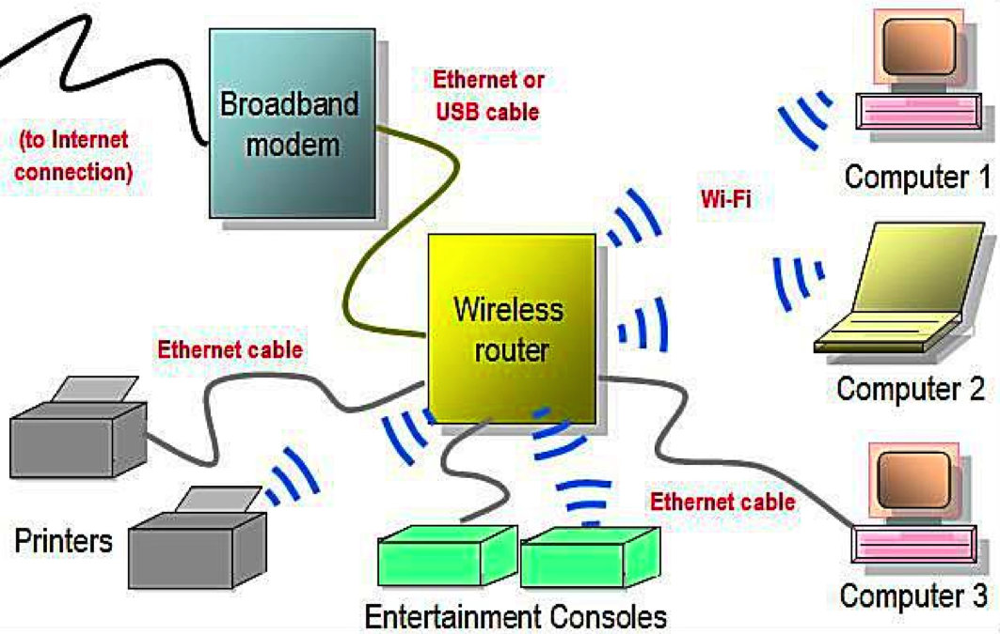
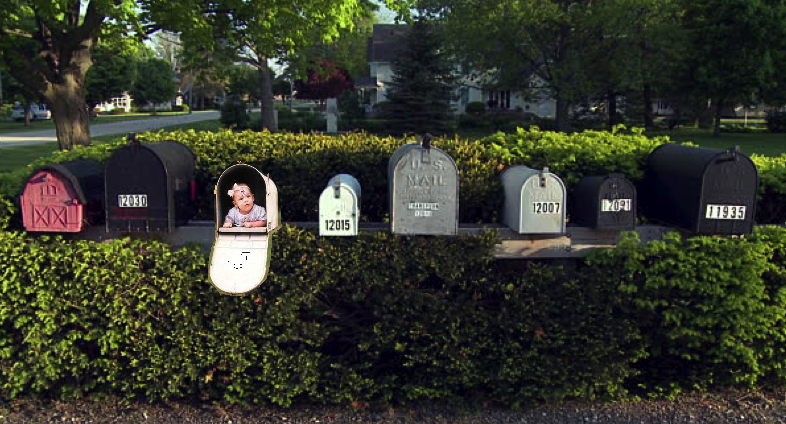
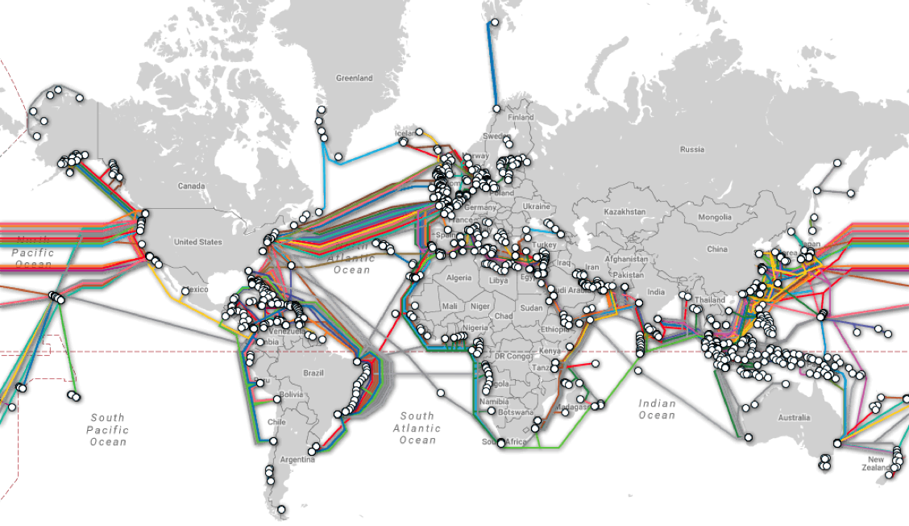
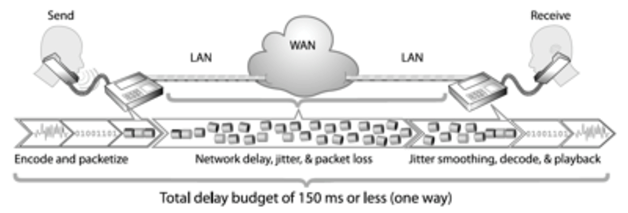
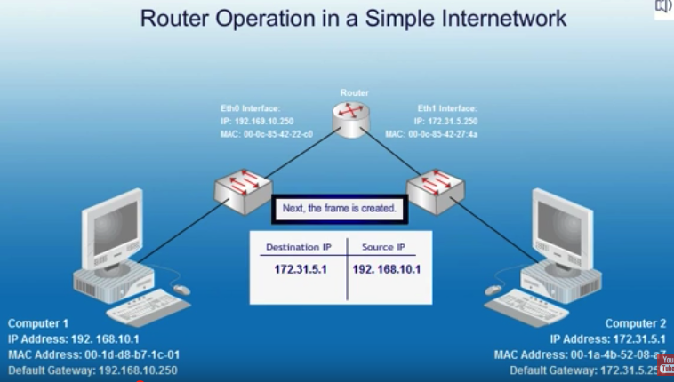
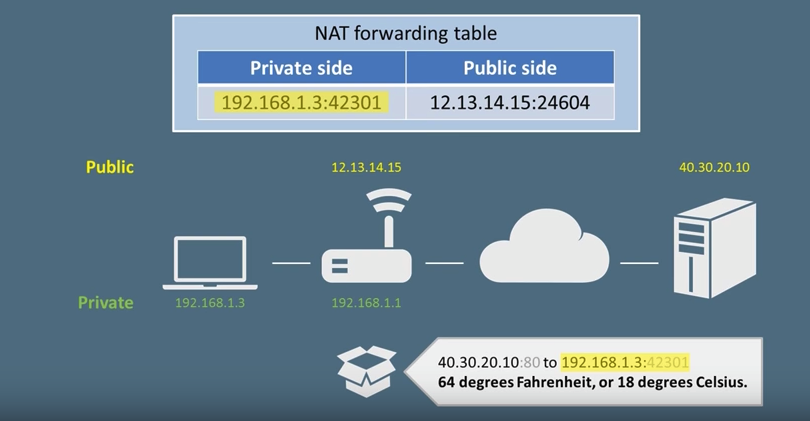
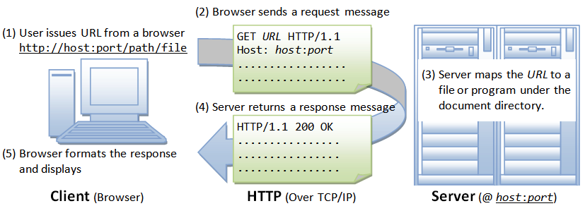

# How the Internet Works Part 1

---
### The Internet is the most recent evolution of electronic communications technology built on the shoulders of the television, telephone, shortwave radio and before that the telegraph. But even before the telegraph, humans had figured out a way to send messages to other tribe members over tens of miles using smoke signals. Smoke signals were a binary code that used groups of two sizes of smoke releases being controlled using tarp or blanket over a fire. The Internet uses binary light pulses to send data around the world on fiber optic cables using the same binary coding technique.

### One beneficial aspect of smoke signals or telegraph is the message is received very quickly compared to a written letter being delivered by an Inca foot messenger or the US Postal Service, taking days. A written message might not even get there should an accident befall the messenger and modern postal letters and packages do get lost.

### There are a few typical ways people want to communicate: using their voice, in writing or images. Communication also happens over long distances and over long periods of time through books for example. The Internet is a communication medium that can represent all previous forms and is a convergence medium.

### The Internet provides all of these modes of communication over wires using bursts of electrons, over fiber optic cables using light pulses and over modulated radio waves. The Internet is a binary communications medium in that it sends information using binary digits, 0 and 1 in groups of 8 based on 8 bits in a byte being a computer technology standard.

### Information on the Internet is encoded into chunks of 8 bit bytes that are then grouped into strings of characters and larger numbers. A computer wishing to send information has a unique IP address, which is encoded in four bytes, and it sends the information to a another computer which has a different unique IP address. IP stands for Internet Protocol. The Internet is much like our modern postal service with each house, apartment and building having a mailbox with a globally unique address in which an envelope or package can be sent or received.

### The Internet moves information packets just like postal envelopes. Postal envelopes move from the sender, through a network of postal offices where they are repeatedly sorted and moved by various trucks, planes and postal worker hands till they reach the destination mail box. Internet packets leave the sending computers networking hardware and are moved through dozens of Internet routers, nationwide fiber optic networks, and inter-country and inter-continential fiber optic cables until they reach the destination computers network hardware. This system and process is called a packet switched network.

### The Internet has a standards organization that develops protocols to structure how information is encoded so computers can have a standard way of encoding and decoding information for various purposes, such as web pages versus live voice. The Internet tends to use many packets to accomplish sending information as the amount of data a single packet can hold is about 1500 bytes/characters, which is enough for a text message, but not enough for a web page, images, voice and video which require hundreds of thousands or millions of bytes/characters. Protocols are ways of specifying various sections and encoding patterns for information as well as providing security and reliable delivery for certain types of information.

### The protocols are like an onion, with different layers handling certain aspects of moving information in useful ways.  For example, the HTTP protocol is used by web servers and browsers. HTTP protocol uses TCP which uses IP protocol which uses lower network layers to send web pages to your browser. There is a standard for networking called the OSI 7 layer stack for networking hardware and software which has been implemented in Ethernet, WiFi and all popular operating systems as API's for applications to use. 

### The networking standards organization created the layered networking model where each layer provide a unique function while moving information across the Internet. Some types of information are time sensitive and if a packet gets lost along the way, asking for it to be retransmitted would not be useful. For example, if two computers are sending real-time voice sounds information and the receiving computer has to ask for a retransmission of a lost packet only to get it half a second later, that would cause the sound to stop for half a second. Internet packets, like real postal mail, take time to move from sender to destination, and if packets are carrying voice information, it is better to just have a few milliseconds of silence if a packet gets lost than pausing the sound to wait for the lost packet to be resent and then having a half second delay ongoing in the sound.  So voice protocols do not use automatic retransmission of lost packets, where web page information requires all the information for the page to display properly and requires all packets and uses a protocol that provides reliable packet delivery with automatic retransmission of lost packets.

### So we've covered Internet packets, IP addresses, protocols and networking layers so lets do a brief exercise. Students organize into groups of 2 with one student acting as sender and another as the destination.  Using a piece of paper cut into 4 pieces or 4 index cards, have the sender write a sentence or secret message of about twenty words splitting the sentence across the 4 pieces of paper and numbering each piece in the upper left corner from 1 to 4. On the back of the paper, write the senders last name in upper left corner and the destinations last name in the middle. From now on we will call these pages packets. Now the instructor or a designated student will act as the Internet and Internet Router and accept packets from senders in a random pattern, one at a time, and then give the packet to the right destination student.  Do this until all destination students have received their 4 packets and can read the sentence once they organize it by page number.
### To add more challenge to this exercise after completing it once, have the destination students return all the packets to the sending students, and this time have the person acting as the Internet Router lose (hand one packet from each sender back to them), which could be the first, second, third or fourth packet.  Once the destination students have three of the four packets, have the destination student write on a piece of paper, the page number they want that is missing, and their last name on the back in the top left corner and the senders last name in the middle and have them pass that packet to the person acting as the Internet Router. The person acting as Internet Router will then pass that packet to the appropriate sender. The sender upon receiving the retransmission request packet will hand the "lost" packet back to the person acting as the Internet Router who then hands it to the destination student, completing the reception of all four pages.

### this exercise is a simulation of the TCP/IP protocol and full network stack and Internet infrastructure including a lost packet retransmission.

### Lets watch the video which shows how packets move across a local area network.

[Router Operation in a Simple Internetwork](https://www.youtube.com/watch?v=GTyE4eHxMuY)

### Now that we have seen how packets move through a local area network or LAN, lets explore why we need some additional technology called Network Address Translation, or NAT when we send packets across the Wide Area Network, or WAN (Internet). Hint, 4 billion IP addresses arn't nearly enough for all the servers and devices we already use which number in the tens of billions.

### Lets watch the video on NAT Packet Routing.

[Network Address Translation Packet Routing](https://www.youtube.com/watch?v=QBqPzHEDzvo)

### So now that we can see how packets move between computers on a LAN and across the Internet using NAT routers (which also protect computers from being attacked by hackers as a nice side effect), it is time to explore how a browser requests a web page from a web server. We are going to ignore domain name resolution for now, which takes a name like www.google.com and turns that into an IP address like 40.30.20.10, and just focus on the HTTP request and response cycle.

### Lets watch the video on the HTTP Request and Response Cycle.

[HTTP Request and Response Cycle](https://www.youtube.com/watch?v=DrI2lUXL1no)

